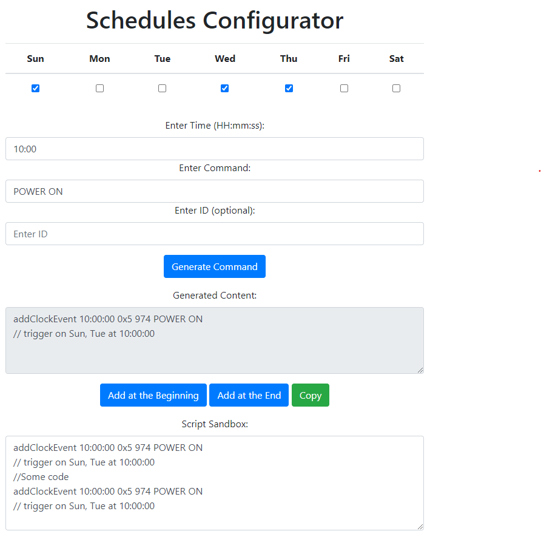

# Utility

The "utility" folder houses a versatile set of command-line tools aimed at simplifying various tasks and enhancing interactions with the CLI.

## Scheduler Configuration
 
 **Description:** This tool provides a user-friendly interface for generating complex commands effortlessly. It allows users to input parameters, options, and flags, generating the corresponding command for execution.

1. **Scheduler Configuration**
   - Simplify the configuration of scheduled events with this tool. Specify days, times, and associated commands to generate the appropriate command lines for scheduling tasks on specific days of the week.

2. **Script SandBox** Script Sandbox allows users to adjust and modify scripts within the web page, offering options to add generated commands at the beginning or end of existing scripts.

 ## other tools...

